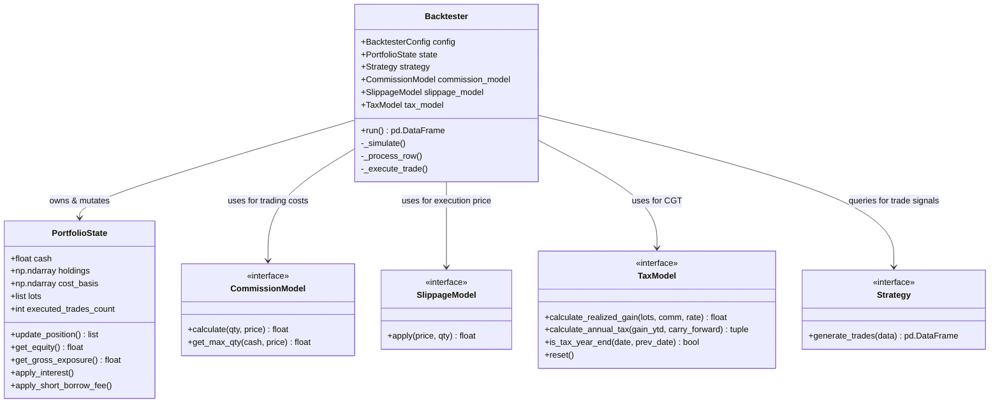

# AlgoTradingBot Backtester Documentation
Welcome to the documentation for the **AlgoTradingBot Backtesting Engine**. This document provides a complete guide to how the backtester works, ranging from high-level architectural abstractions down to low-level implementation details, as well as a financial foundation section designed for laymen.

---

## 1. Financial Foundation for Laymen

Before diving into the code, it is critical to understand the real-world financial concepts that this backtester simulates. When trading stocks, especially as a retail investor or a full-time employee, execution is not as simple as "buying at the price you see on the screen." Multiple frictions, rules, and risks affect your returns.

### 1.1. Backtesting & Lookahead Bias
*   **What is Backtesting?** Backtesting is the process of simulating a trading strategy using historical market data. It answers the question: *"How would this strategy have performed in the past?"*
*   **What is Lookahead Bias?** This is one of the most common and dangerous errors in backtesting. It occurs when a strategy uses information from the "future" to make a decision in the "present." For example, if a strategy decides to buy a stock on Monday morning because its *Monday Close* price is high, it is using future information. To prevent lookahead bias, this backtester uses an **execution delay** (e.g., generating a signal at the close of Day $T$ and executing it at the open of Day $T+1$) and calculates overnight borrow fees using the *previous* day's close price.

### 1.2. Margin and Leverage
*   **Cash Account vs. Margin Account**: In a cash account, you can only buy stocks using the cash you have deposited. In a margin account, you can borrow money from your broker to buy more stocks than your cash balance would allow.
*   **Leverage**: This is the ratio of your total investment exposure to your net cash/equity. If you have $10,000 in cash and buy $20,000 worth of stock, you are using **2x leverage**. Leverage amplifies both gains and losses.
*   **Maintenance Margin & Margin Calls**: If you borrow money to buy stocks, the stocks serve as collateral for the loan. If the stock prices fall, the value of your collateral decreases. The **Maintenance Margin Ratio** (e.g., 25%) is the minimum percentage of net equity to gross exposure you must maintain. If your equity falls below this threshold, you receive a **Margin Call**, and the broker will forcibly sell (liquidate) your positions at the current market price to repay the loan and protect themselves from loss.

### 1.3. Slippage and Bid-Ask Spread
*   **Slippage**: When you place a large buy order, you might push the market price up slightly, or the market might move before your order is filled. The difference between the price you expected to get and the price you actually got is called *slippage*.
*   **Bid-Ask Spread**: At any moment, there are two prices for a stock: the *Bid* (the highest price a buyer is willing to pay) and the *Ask* (the lowest price a seller is willing to accept). If you buy, you buy at the Ask; if you sell, you sell at the Bid. This spread acts as a transactional cost and is simulated in this engine via a constant percentage slippage model.

### 1.4. FX Conversion Fees (Foreign Exchange Markup)
*   **Multi-Currency Accounts**: If you live in the UK (account currency in GBP) or Europe (EUR) and trade US stocks (denominated in USD), your broker must convert your home currency to USD every time you buy, and back to your home currency when you sell.
*   **FX Markup**: Brokers charge a fee (e.g., 0.15% to 0.35%) on these currency conversions. This markup is applied to the exchange rate. For example, if 1 GBP = 1.25 USD, buying USD stocks effectively uses a rate of `1.25 * (1 - fx_pct)` (you get fewer dollars per pound), and selling uses `1.25 * (1 + fx_pct)`. This backtester simulates this frictional drag precisely.

### 1.5. Capital Gains Tax (CGT) & Lot Matching
When you sell a stock for more than you bought it, you owe Capital Gains Tax on the profit. However, if you buy shares of the same stock at different times and prices (different "lots"), determining which shares you are selling is complex. Different jurisdictions have different rules:
*   **First-In, First-Out (FIFO)**: The oldest shares you bought are assumed to be the first ones you sell. This is the baseline method used by the backtester to track cost basis.
*   **US IRS Wash Sale Rule**: In the US, if you sell a stock at a loss and buy the same stock again within 30 days, you cannot claim the tax deduction for that loss. Instead, the loss is added to the cost basis of the newly purchased shares, deferring the tax benefit.
*   **UK HMRC Share Matching & Section 104 Pool**: In the UK, when you sell shares, HMRC matches them in this order:
    1.  *Same Day*: Shares bought on the same day as the sale.
    2.  *Bed & Breakfasting*: Shares bought within 30 days after the sale.
    3.  *Section 104 Pool*: All other shares are averaged together into a single "pool" with an average cost basis.
    UK tax rules also require converting the purchase cost to GBP using the exchange rate on the **purchase date**, and the sale proceeds using the exchange rate on the **disposal date**. Net gains are offset against an **Annual Exempt Allowance** (tax-free limit) before any tax is due.

---

## 2. High-Level Architectural Abstraction

The backtester is designed around the **Single Responsibility Principle (SRP)** and uses object-oriented modularity. It separates configuration, account state representation, and execution model policies.

### 2.1. Domain Modules
1.  **`Backtester` ([backtester.py](file:///Users/ghoang/Desktop/Projects/AlgoTradingBot/backtester.py))**: The orchestrator. It manages the configuration data class, loops day-by-day chronologically, executes signals, and formats performance logs.
2.  **`PortfolioState` ([portfolio_state.py](file:///Users/ghoang/Desktop/Projects/AlgoTradingBot/portfolio_state.py))**: The source of truth for the account's cash, open stock holdings, cost basis ledger, FIFO transaction lot history, and executed trade counts.
3.  **`CommissionModel` & `SlippageModel` ([trading_models.py](file:///Users/ghoang/Desktop/Projects/AlgoTradingBot/trading_models.py))**: Interfaces and default implementations that calculate broker fees, minimum ticket charges, FX conversion markups, and bid-ask spreads.
4.  **`TaxModel` ([trading_models.py](file:///Users/ghoang/Desktop/Projects/AlgoTradingBot/trading_models.py))**: Abstract interface defining how capital gains taxes, exempt allowances, and loss carry-forwards are calculated for different tax jurisdictions (US, UK, Tax-Free).
5.  **`Strategy` ([data_structures.py](file:///Users/ghoang/Desktop/Projects/AlgoTradingBot/data_structures.py))**: Abstract class that reads historical market data and generates trade signals (shares to buy or sell).

---

## 3. Detailed Implementation & Execution Workflow

### 3.1. Main Simulation Loop
When `Backtester.run()` is called:
1.  **Signal Generation**: The strategy generates an offline matrix of daily trades.
2.  **Delay Alignment**: If `execution_delay > 0`, signals are shifted forward by the delay (e.g. 1 day) to eliminate lookahead bias.
3.  **Instantiation**: The `PortfolioState` is created, and `self.tax_model.reset()` is invoked.
4.  **Simulation Iteration**: The loop iterates through each date:
    *   **Daily Frictions**: Adds periodic deposits (converted to the base account currency with deposit-date exchange rates) and charges compounding interest on negative cash balances.
    *   **Transaction Processing**: Executes trades using the day's open/close prices.
    *   **Margin Check**: Computes net equity and gross exposure (using intraday Low/High values if available). If margin requirements are breached, a full portfolio liquidation is triggered.
5.  **Final Deferral**: Settles any final capital gains tax at the end of the simulation.

### 3.2. Order Execution Logic
For any non-zero trade signal on a given asset:
1.  **Slippage Application**: The price is adjusted using the slippage model.
2.  **Flipping Check**: If the transaction changes the position from long to short (or vice versa), the order is split into a **closing transaction** and an **opening transaction** to prevent double-charging flat commissions and apply correct risk clamping.
3.  **Buying Power Clamping**:
    *   For a buy order opening/extending a long position: `_clamp_buy_quantity` uses the commission model's `get_max_qty` to restrict the order size based on available cash (or max margin leverage). To account for FX markups, the price passed to the commission model is adjusted to `price_eff / (1.0 - fx_pct)`.
    *   For a short-selling order: `_clamp_short_quantity` restricts the size to prevent violating leverage limits.
    *   *Note*: Buy-to-cover orders (closing short positions) reduce risk and are excluded from buying power clamps.
4.  **Position Updates**: `PortfolioState.update_position` records the trade, updates the average cost basis, and performs FIFO matching against active lots. It returns a list of matched lots with acquisition dates and historical exchange rates.
5.  **Realized Capital Gains**: The `TaxModel` is called with the realized lots list to compute the net gain or loss in the account currency. YTD metrics are updated.
6.  **Cash Deduction**: The total trade cost is subtracted from `state.cash`:
    $$\text{Cost}_{\text{account}} = \frac{\text{Quantity} \times \text{Price}_{\text{effective}}}{\text{Rate} \times (1 \pm \text{FX Markup})} + \frac{\text{Commission}_{\text{USD}}}{\text{Rate}} + \text{Immediate Tax}$$

---

## 4. Code Quality & Clean Code Implementation

The codebase has been refactored to align with key Clean Code metrics:

*   **Single Responsibility Principle**:
    *   `PortfolioState` does not know how commission is calculated or what the tax rate is; it only manages holdings, lots, and arithmetic cash additions.
    *   `TaxModel` subclasses do not query market prices; they receive calculated realized transaction lots and return tax liabilities.
*   **The Boy Scout Rule**:
    *   Refactored complex blocks in `backtester.py` (like cash conversion, clamping, and deposit steps) into monadic/dyadic helper functions under 20 lines.
*   **F.I.R.S.T. Unit Tests**:
    *   **Fast**: The test suite runs in less than 40 milliseconds.
    *   **Independent**: The test classes use setup steps and mock strategies to run independently of system state.
    *   **Arrange-Act-Assert**: All tests clearly divide test configuration (Arrange), running the backtester (Act), and assertions (Assert).
